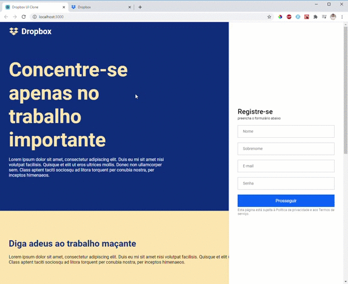

# UI CLONE - 
> Clone da Interface do Dropbox. 

##### Tecnologias Usadas
- [Reactjs](https://pt-br.reactjs.org/)
- [Styled Components ](https://styled-components.com/)
- [React Icons](https://react-icons.github.io/react-icons/)

## Author
> ##### Projeto ensinado por [Guilherme Rodz](https://github.com/guilhermerodz) - Rocketseat [Link](https://www.youtube.com/watch?v=VqP1ECc_j4M)
👤 **Douglas Carvalho**

* Github: [@dougcarvalho92](https://github.com/dougcarvalho92)
* LinkedIn: [@dscarvalho92](https://linkedin.com/in/dscarvalho92)

## 📝 License

Copyright © 2020 [Douglas Carvalho](https://github.com/dougcarvalho92).
